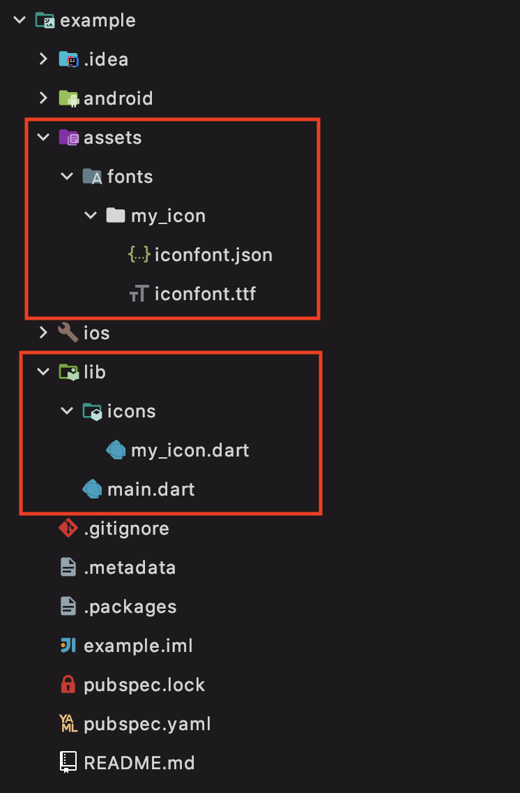

# iconfont [](https://pub.dartlang.org/packages/iconfont)

只需一行命令，即可快速生成[https://www.iconfont.cn/](https://www.iconfont.cn/)的Icon文件。


## 特点

1. 支持多个Iconfont项目。
2. 可自动在 `pubspec.yaml` 中注册字体


## 安装

### 方式1

#### 注册
 
> `pub global activate iconfont`

#### 使用

> `pub global run iconfont`


### 方式2

#### 注册
 
> `flutter pub global activate iconfont`

#### 使用

> `flutter pub global run iconfont`


### 方式3

#### 注册
> 在 `pubspec.yaml` 中添加
```yaml
dev_dependencies:
  iconfont: #latest version
```

#### 使用

>  `flutter packages pub run iconfont`


## 参数
```text
-i, --in      iconfont文件所在目录
              (defaults to "assets/fonts/")
-o, --out     生成后文件存放目录
              (defaults to "lib/icons/")
-h, --help    help
-s, --skip    覆盖pubspec.yaml文件，将丢失pubspec.yaml中的注释
```


## 例子



